# Network Traffic Analysis Lab

## Why I started

When I reached the networking section of the Google Cybersecurity Certificate, it felt like I was memorizing terminology. I knew that wasn't going to work for me. I wanted to see what those terms actually meant, so I used AI to help me explore networking in a virtual machine.

I could open a page, submit a form, and look at the traffic those actions created. That gave me a way to start understanding how computers communicate over networks. Then I found the dummy password I had submitted over HTTP sitting there in plain text in Wireshark. I could actually see why encryption mattered. Understanding how the communication worked, and how much it needed protecting, was the “aha” moment for me.

My background is in biology. One of my favorite subjects in college was organic chemistry because I could visualize reactions and follow how things worked. I enjoyed that way of learning, but the career paths I saw after my degree didn't interest me in the same way. Exploring networking brought back that feeling of wanting to understand what was happening and why.

I started calling these sessions “VM mode.” They became something I looked forward to doing after studying for the certificate, and eventually a hobby. This lab sparked my passion for cybersecurity and a curiosity about computers that has kept growing.

I recreated the lab for this write-up so I could keep a record of the experience that got me interested in networking.

## My setup

I ran small Python web servers in an Ubuntu VM, opened the pages from the host machine, and captured traffic in Wireshark on the virtual network interface, `virbr0`.

| Part of the lab | Address or port |
| --- | --- |
| Host lab address (also the VM gateway and DNS server) | `192.168.122.1` |
| Ubuntu VM | `192.168.122.106` |
| HTTP server | TCP `8000` |
| HTTPS server | TCP `8443` |

The login forms used dummy credentials and only generated traffic; they didn't authenticate a real account. The screenshots come from several separate runs, so process IDs and client port numbers change between some captures.

## Checking the connection on the VM

Before starting the HTTP server, I checked for sockets using port `8000`:

```bash
sudo ss -tunap | grep ':8000'
```

The command returned no matching entries.

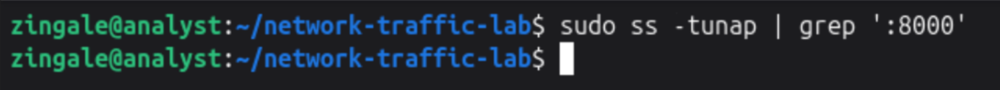

After starting the server, the same command showed `python3` listening on `192.168.122.106:8000`. The `LISTEN` state meant the server was waiting for connections.

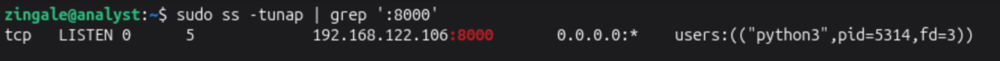

In another run, with a client connected, the command showed both a listening socket (`LISTEN`) and an established connection (`ESTAB`). Both belonged to `python3`. I used `ps -fp 4989` to see the server command for that process.

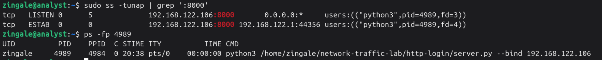

The connection was between `192.168.122.1:44356` and `192.168.122.106:8000`. I found those same addresses and ports in Wireshark, along with the TCP handshake. This helped me connect what the VM reported to what I was seeing in the packet capture.

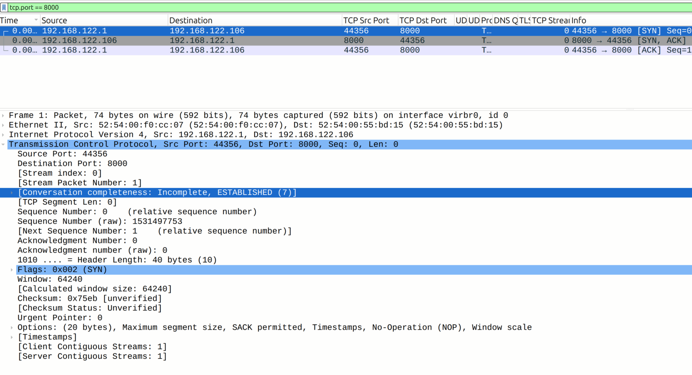

## Opening the page and submitting the HTTP form

I opened the HTTP login page on port `8000` and submitted the dummy form.

<details>
<summary>Browser screenshots: HTTP form and submission</summary>

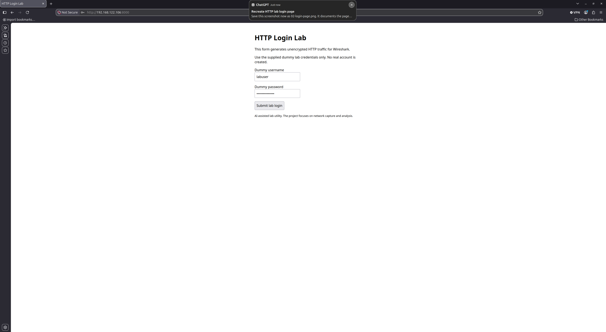

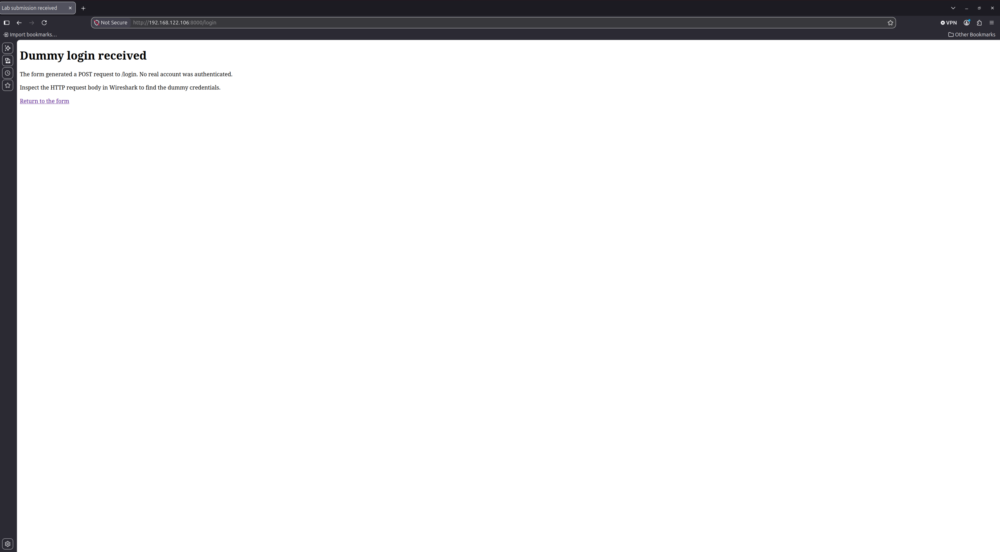

</details>

With the Wireshark filter `tcp.port == 8000`, I could see the three parts of the TCP handshake: `SYN`, `SYN, ACK`, and `ACK`. After that came the browser's `GET /` request and the server's `200 OK` response.

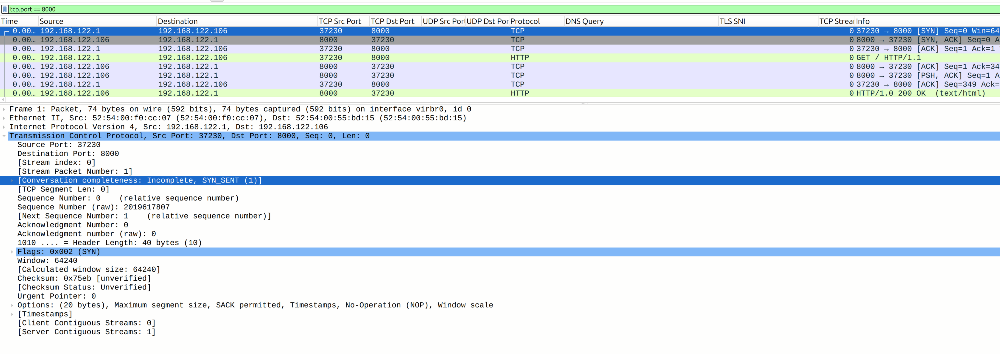

To find the form submission, I used `http.request.method == "POST"`. In the decoded form fields, I could read the dummy username, `labuser`, and password, `NetworkLab123!`.

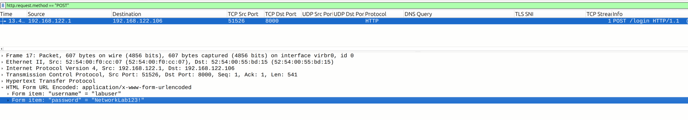

The password had appeared as dots in the browser, but it was readable in the capture. That surprised me. Hiding the characters on screen hadn't protected them as they traveled across the network. Seeing the password for myself made me understand why encryption is so important when sending private information.

## Comparing it with HTTPS

I repeated the form submission using the HTTPS server on port `8443`. This lab used a self-signed certificate. The browser showed a security warning, while the packet capture showed that the connection was using TLS encryption. Certificate trust and encryption are separate: a connection can be encrypted even when the browser doesn't trust the certificate.

<details>
<summary>Browser screenshots: HTTPS form and submission</summary>

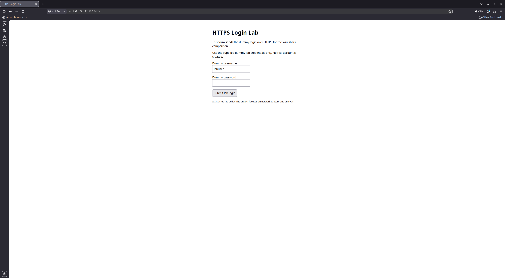

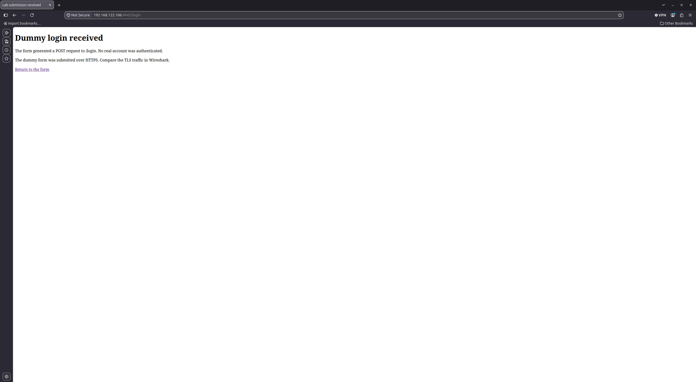

</details>

With the filter `tcp.port == 8443`, the packet list showed the TCP handshake, then TLS `Client Hello` and `Server Hello` messages, followed by encrypted traffic.

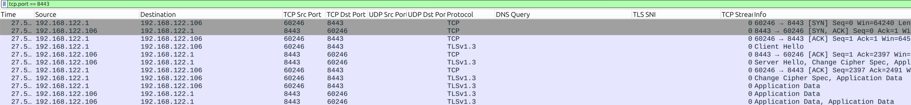

Using `tcp.port == 8443 && tls`, I could see the addresses and ports, but the form fields weren't readable as they had been with HTTP. Wireshark displayed `Encrypted Application Data` in this capture.

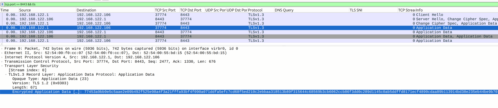

## Looking at DNS

In a separate check, I queried `example.com` from the VM:

```bash
dig @192.168.122.1 example.com A
```

With the `dns` filter, I could see the query going to `192.168.122.1` on UDP port `53` and the response coming back. The response contained two IPv4 addresses. This let me see the question and answer involved in looking up a name.

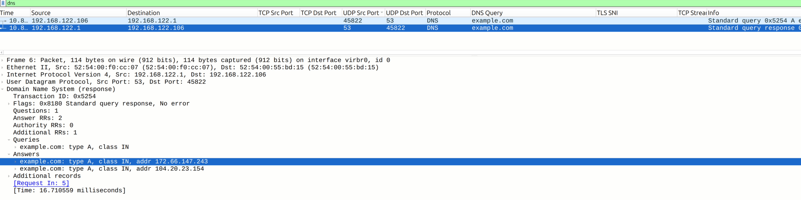

## Finding the gateway

With the `arp` filter, I could see the VM asking who had `192.168.122.1`. The reply gave the gateway's MAC address: `52:54:00:f0:cc:07`.

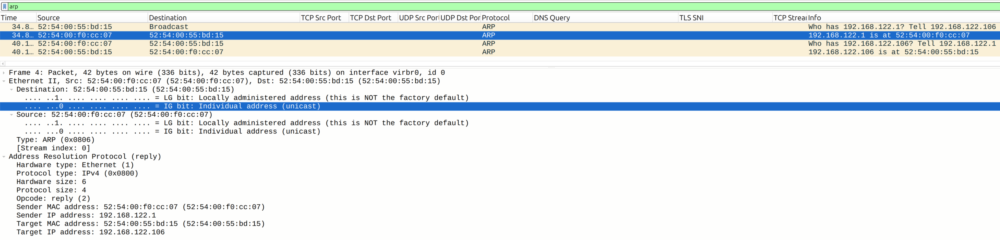

I then checked the route the VM would use for `8.8.8.8` and its saved neighbor entry for the gateway:

```bash
ip route get 8.8.8.8
ip neigh show 192.168.122.1
```

The route lookup selected `192.168.122.1` as the next hop through `enp1s0`. The neighbor entry showed the same MAC address as the ARP reply. I could connect the route's next hop to the address learned through ARP.

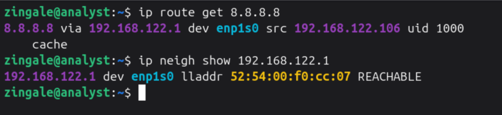

## What I took from this

I learn better when I can do something and then follow what happens. In this lab, I could trace a browser action into a packet capture and match a connection to a process on the VM. Comparing the readable HTTP form with encrypted HTTPS traffic helped me understand why those communications need protection. Learning the networking made me want to understand more about security, and I kept coming back to the VM to explore.

The lab helped me understand the network communication involved in accessing a website. I started to connect the jobs of DNS, ARP and routing, TCP, and HTTP, with TLS protecting the HTTP traffic when I used HTTPS. Seeing those pieces in my own lab helped me start understanding how my computer can communicate with servers around the world.

## AI assistance

I used AI to help explain concepts, work through the lab, and generate the Python code for the test websites. I ran the lab, captured the traffic, and worked through what I was seeing with that help. I also used AI to help organize this write-up around my screenshots and my experience.
